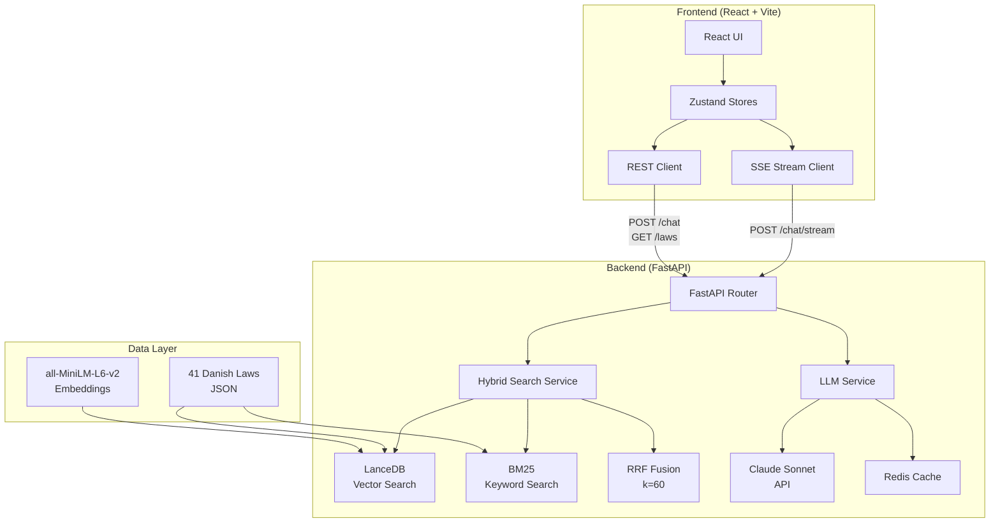

<div align="center">

# 🏛️ Danish Legal Assistant

**AI-powered search and Q&A for Danish law — built with Claude AI, FastAPI, and React**

[](https://python.org)
[](https://fastapi.tiangolo.com)
[](https://react.dev)
[](https://anthropic.com)
[](https://lancedb.com)
[](LICENSE)
[](https://github.com/features/actions)

*Ask questions about Danish immigration, tax, labor, and business law in plain English. Get cited, AI-powered answers in seconds.*

[🚀 Live Demo](#) · [📖 API Docs](http://localhost:8000/docs) · [🐛 Report Bug](#) · [💡 Request Feature](#)

</div>

---

## ✨ Features

| Feature | Description |
|---|---|
| 🤖 **Claude AI RAG** | Retrieval-Augmented Generation with Claude Sonnet — cites exact law references |
| 🔍 **Hybrid Search** | LanceDB semantic + BM25 keyword + Reciprocal Rank Fusion (RRF) |
| 📚 **41 Real Laws** | Immigration (16), Tax (10), Labor (10), Business (5) — all verified |
| 🌊 **Streaming SSE** | Real-time typewriter token streaming from Claude API |
| 🧙 **Onboarding Wizard** | Personalized experience based on user profile |
| ✅ **Checklist Generator** | Step-by-step guides: Work Permit, Start Business, Tax Registration |
| ⚖️ **Comparison Mode** | Side-by-side AI comparison of any two Danish legal topics |
| 📊 **Analytics Dashboard** | Query stats, confidence distribution, response times at `/admin` |
| ⌨️ **Keyboard Shortcuts** | `/` focus, `Esc` close, `Ctrl+K` search, `?` help |
| 🌙 **Dark Mode** | Full dark/light theme with localStorage persistence |
| 📤 **Export** | Save conversations as `.txt` or copy share link |
| 🔒 **Security** | Rate limiting, security headers, non-root Docker, CORS |

---

## 🏗️ Architecture



---

## 🚀 Quick Start

### Option A: Docker (recommended)

```bash
# 1. Clone
git clone https://github.com/your-username/danish-legal-assistant-v2.git
cd danish-legal-assistant-v2

# 2. Configure
cp backend/.env.example backend/.env
# Edit backend/.env and add your ANTHROPIC_API_KEY

# 3. Start everything
docker compose up -d

# App running at:
#   Frontend → http://localhost
#   Backend  → http://localhost:8000
#   API Docs → http://localhost:8000/docs
```

### Option B: Local Development

**Prerequisites:** Python 3.11+, Node 20+

```bash
# Backend
python -m venv venv && source venv/bin/activate
pip install -r backend/requirements.txt
cp backend/.env.example backend/.env
# Add ANTHROPIC_API_KEY to backend/.env
make run          # → http://localhost:8000

# Frontend (new terminal)
cd frontend && npm install
npm run dev       # → http://localhost:5173
```

---

## 📁 Project Structure

```
danish-legal-assistant-v2/
├── backend/                    # FastAPI backend
│   ├── app/
│   │   ├── config.py           # Settings (pydantic-settings)
│   │   ├── main.py             # FastAPI app + middleware
│   │   ├── models/
│   │   │   ├── database.py     # LanceDB singleton + auto-rebuild
│   │   │   └── schemas.py      # Pydantic models
│   │   ├── routers/
│   │   │   ├── chat.py         # POST /chat, /chat/stream
│   │   │   ├── laws.py         # GET /laws, /laws/{id}, /laws/stats
│   │   │   └── search.py       # POST /search
│   │   └── services/
│   │       ├── llm_service.py  # Claude RAG + streaming
│   │       ├── search_service.py # Hybrid BM25 + LanceDB + RRF
│   │       ├── law_service.py  # JSON law loader
│   │       └── cache_service.py # Redis caching layer
│   ├── Dockerfile              # Multi-stage: builder + slim runtime
│   └── requirements.txt
├── frontend/                   # React + Vite frontend
│   ├── src/
│   │   ├── components/
│   │   │   ├── chat/           # ChatInterface, ChatMessage, ChecklistGenerator, ComparisonMode
│   │   │   ├── onboarding/     # OnboardingWizard
│   │   │   ├── law/            # LawCard, LawCatalog
│   │   │   └── ui/             # Toast, SearchSuggestions, ExportButton
│   │   ├── pages/              # Home, Chat, Laws, About, Admin
│   │   └── store/              # Zustand: chat, laws, theme, onboarding, analytics
│   ├── Dockerfile              # Multi-stage: Node build + Nginx serve
│   └── nginx.conf              # Gzip, security headers, SPA routing, API proxy
├── data/
│   └── danish_laws_production.json  # 41 verified Danish laws
├── database/
│   └── danish_legal_db/        # LanceDB vector store (auto-rebuilt)
├── .github/workflows/
│   ├── ci.yml                  # Full CI/CD: test → build → push → deploy
│   └── pr-check.yml            # PR quality gate
├── docker-compose.yml          # Production: Redis + Backend + Frontend
├── docker-compose.dev.yml      # Development: hot reload
└── Makefile                    # All common commands
```

---

## 🔌 API Reference

All endpoints are prefixed with `/api/v1`. Interactive docs at `/docs`.

### Chat
```http
POST /api/v1/chat
Content-Type: application/json

{
  "query": "What is the salary requirement for the Pay Limit scheme?",
  "category": "immigration",   // optional filter
  "top_k": 5,
  "conversation_id": "uuid"    // optional for context
}
```

Response includes: `answer` (markdown), `sources` (cited laws), `follow_up_questions`, `confidence`, `llm_used`.

```http
POST /api/v1/chat/stream        # SSE streaming version
```

SSE events: `token` | `sources` | `follow_ups` | `done` | `error`

### Laws
```http
GET /api/v1/laws?category=immigration&page_size=20
GET /api/v1/laws/{id}
GET /api/v1/laws/stats
GET /api/v1/search              # POST with { "query": "...", "top_k": 5 }
```

---

## 🌐 Deployment

### Railway (recommended — one click)

1. Connect your GitHub repo to Railway
2. Add environment variables in Railway dashboard:
   ```
   ANTHROPIC_API_KEY=sk-ant-...
   REDIS_URL=${{Redis.REDIS_URL}}    # auto-filled by Railway Redis plugin
   CORS_ORIGINS=["https://your-frontend.railway.app"]
   ```
3. Deploy — Railway auto-detects `docker-compose.yml`

### Render

1. Create two Web Services: backend (port 8000) + frontend (port 80)
2. Set build/start commands per `Dockerfile`
3. Add `ANTHROPIC_API_KEY` environment variable

### fly.io

```bash
flyctl launch --dockerfile backend/Dockerfile   # backend
flyctl launch --dockerfile frontend/Dockerfile  # frontend
flyctl secrets set ANTHROPIC_API_KEY=sk-ant-...
flyctl deploy
```

---

## ⚙️ Environment Variables

| Variable | Required | Default | Description |
|---|---|---|---|
| `ANTHROPIC_API_KEY` | ✅ Yes | — | Claude API key for AI answers |
| `REDIS_URL` | No | — | Redis URL for caching (e.g. `redis://localhost:6379`) |
| `ENV` | No | `development` | Environment name |
| `CORS_ORIGINS` | No | localhost | Allowed frontend origins |
| `RATE_LIMIT` | No | `20/minute` | Rate limit per IP |
| `LLM_MODEL` | No | `claude-sonnet-4-5-20250929` | Claude model name |
| `SENTRY_DSN` | No | — | Sentry error tracking DSN |
| `LOG_LEVEL` | No | `info` | Logging level |

---

## 🛠️ Development

```bash
make run              # Start backend with hot reload
make frontend-dev     # Start React dev server
make test             # Run backend tests
make test-cov         # Tests with coverage report
make lint             # Ruff lint check
make health           # Check API health
make docker-up-d      # Start all containers (detached)
make docker-logs      # Stream container logs
make clean            # Remove Python cache files
```

---

## 🧪 Testing

```bash
# Backend tests
cd backend && pytest tests/ -v

# With coverage
pytest tests/ --cov=app --cov-report=html

# Frontend build check
cd frontend && npm run build
```

---

## 📊 Performance

| Metric | Value |
|---|---|
| Semantic search latency | ~15-50ms |
| Claude AI response (streaming) | ~1-3s to first token |
| LanceDB embedding dimensions | 384 (MiniLM-L6-v2) |
| Laws indexed | 41 |
| Docker image size (backend) | ~2.1GB (incl. ML model) |
| Docker image size (frontend) | ~25MB (nginx + static) |

---

## 🔒 Security

- **Rate limiting**: 20 req/min per IP via slowapi
- **CORS**: Explicit origin allowlist
- **Security headers**: X-Frame-Options, CSP, HSTS-ready, nosniff
- **Non-root Docker**: `appuser` (UID 1001) in backend container
- **Input validation**: Pydantic v2 schemas on all endpoints
- **No SQL**: LanceDB is vector-only, no injection surface

---

## 🤝 Contributing

1. Fork the repository
2. Create a feature branch: `git checkout -b feature/amazing-feature`
3. Make your changes and add tests
4. Run `make lint && make test`
5. Open a Pull Request — CI will run automatically

---

## 📄 License

MIT License — see [LICENSE](LICENSE) file.

---

## 🙏 Acknowledgments

- [Anthropic Claude](https://anthropic.com) — AI backbone
- [LanceDB](https://lancedb.com) — vector database
- [Sentence Transformers](https://sbert.net) — embeddings
- [FastAPI](https://fastapi.tiangolo.com) — backend framework
- [React](https://react.dev) + [Tailwind CSS](https://tailwindcss.com) — frontend

---

<div align="center">
  <sub>Built with ❤️ for navigating Danish bureaucracy</sub>
</div>
